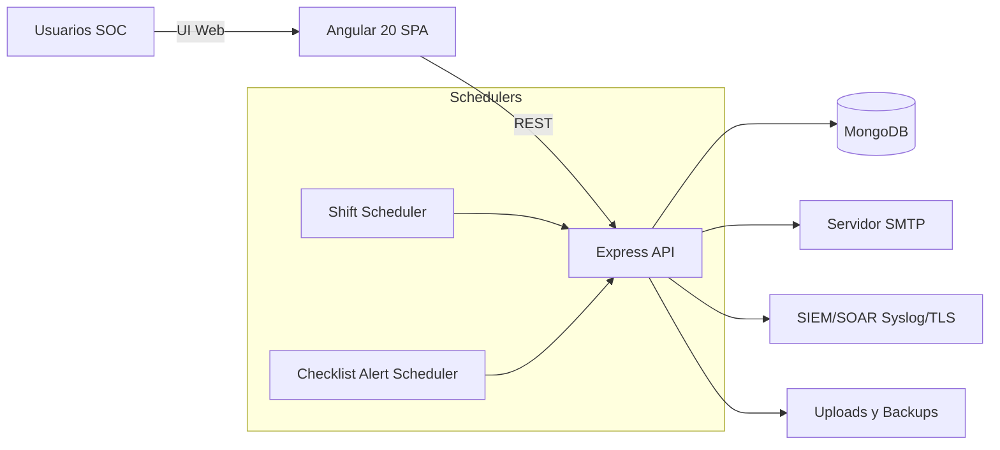
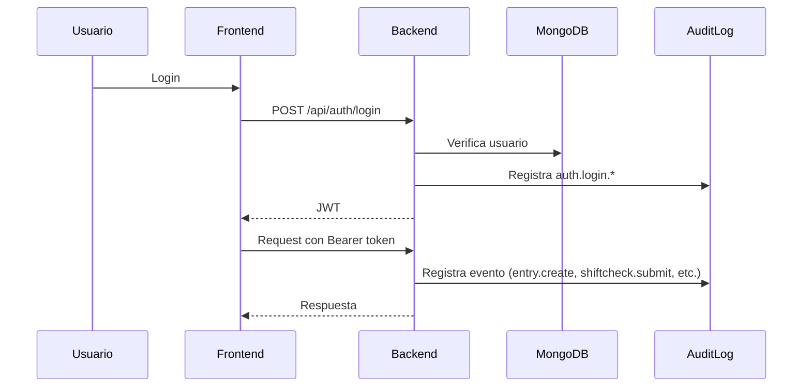
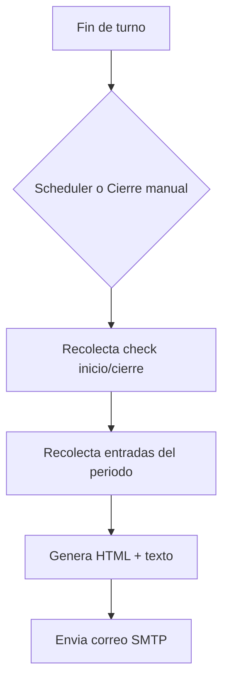

# 🧭 Arquitectura y Flujos - Bitacora SOC

Documentacion visual del funcionamiento general del sistema.

---

## 🗺️ Mapa Conceptual (alto nivel)

---

## 🔐 Flujo de Autenticacion y Auditoria

---

## 📧 Flujo de Reporte de Turno

