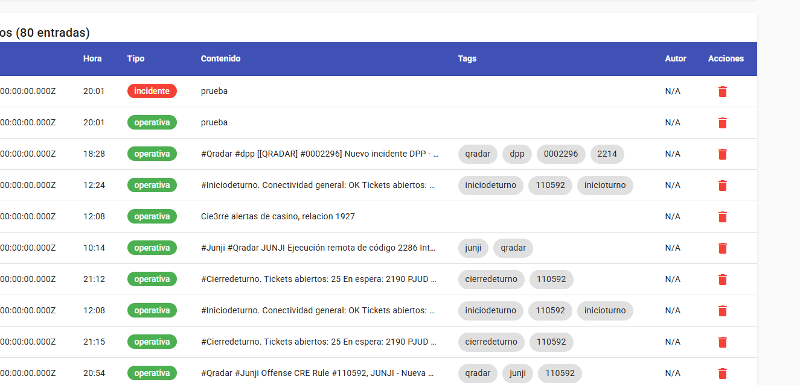
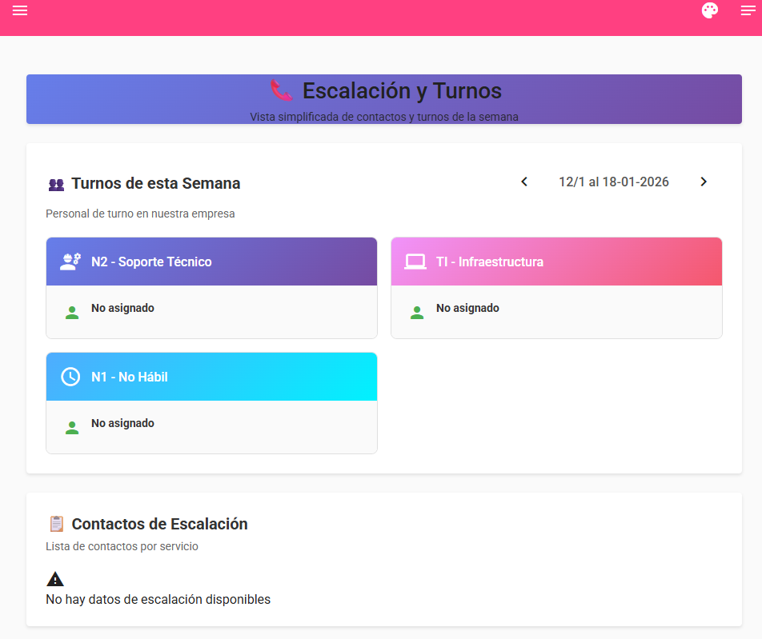
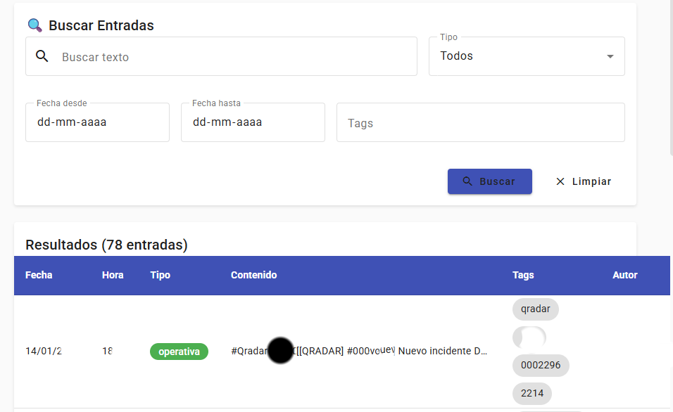

# 📸 Capturas de Pantalla - BitacoraSOC

Documentación visual de las principales funcionalidades del sistema.

---

## 🏠 Pantalla Principal - Nueva Entrada

**Funcionalidades visibles:**
- **Menú Lateral Izquierdo:**
  - ✍️ Escribir (página actual)
  - 📋 Historial Checklists
  - 📞 Escalaciones
  - 📊 Generar Reporte
  - ⏰ Mis Entradas
  - 🌐 Ver todas
  - 👤 Mi Perfil
  - ✅ Checklist (Admin)
  - 📈 Reportes
  - ⚙️ Configuración (Admin)

- **Panel Central - Nueva Entrada:**
  - Fecha del Evento (dd-mm-aaaa)
  - Hora del Evento (HH:mm)
  - Clasificación:
    - 📋 **Operativa**: Eventos rutinarios
    - 🚨 **Incidente**: Eventos que requieren respuesta
  - Campo de texto para descripción con soporte de hashtags (#Trellix #hunting)
  - Autosave activado

- **Panel Derecho - Notas:**
  - 💡 Nota del Administrador (compartida)
  - 🗒️ Mi Nota Personal (privada)

- **Checklist de Turno:**
  - Estado del último check
  - Mensaje si no hay checklist activo asignado

---

## 📞 Escalación y Turnos

**Vista Semanal de Turnos (12/1 al 18-01-2026):**

- **Roles visibles:**
  - 👥 **N2 - Soporte Técnico** (púrpura) - No asignado
  - 💻 **TI - Infraestructura** (rosa) - No asignado
  - ⏰ **N1 - No Hábil** (cyan) - No asignado

- **Navegación:**
  - Flechas para cambiar semana
  - Fecha actual destacada

- **Contactos de Escalación:**
  - Lista de contactos por servicio
  - ⚠️ Mensaje: "No hay datos de escalación disponibles"
  - Requiere configuración por admin

**Funcionalidad:** Permite visualizar quién está de turno en cada rol durante la semana actual, facilitando la coordinación del equipo SOC.

---

## 🔍 Buscar Entradas

**Filtros de Búsqueda:**
- 🔍 **Buscar texto**: Búsqueda en el contenido
- 📑 **Tipo**: Dropdown (Todos/Operativa/Incidente)
- 📅 **Fecha desde**: dd-mm-aaaa
- 📅 **Fecha hasta**: dd-mm-aaaa
- 🏷️ **Tags**: Filtro por etiquetas
- 🔵 **Botón Buscar**
- ❌ **Limpiar**: Resetear filtros

**Tabla de Resultados (78 entradas):**

| Columna | Descripción |
|---------|-------------|
| **Fecha** | dd/mm/aaaa |
| **Hora** | HH:mm |
| **Tipo** | 🟢 operativa / 🔴 incidente |
| **Contenido** | Texto truncado de la entrada |
| **Tags** | Hashtags en chips (qradar, dpp, 0002296, 2214, etc.) |
| **Autor** | Usuario que creó la entrada |

**Ejemplo visible:**
- 14/01/2026 18:28 - Operativa - "#Qradar #dpp [[QRADAR] #0002296] Nuevo incidente D..."
- Tags: qradar, dpp, 0002296, 2214
- Autor: mfuentes

**Funcionalidad:** Permite buscar y filtrar entradas históricas con múltiples criterios para análisis y auditoría.

---

## 📊 Generador de Reportes SOC

**Formulario para Reportes HTML:**

**Campos del formulario:**
1. **Tipo de operación** *
   - Dropdown con autocomplete
   - Validación: "Escribe al menos 0 caracteres para buscar"

2. **Ofensa/Código interno**
   - Campo de texto libre
   - Ejemplo: Número de offense o ticket

3. **Nombre de Ofensa/Evento** *
   - Dropdown con autocomplete
   - Validación: "Escribe al menos 0 caracteres para buscar"

4. **Motivo de la Ofensa/Evento** **
   - Textarea multilínea
   - Descripción detallada del evento

**Funcionalidad:** 
- Genera reportes en formato HTML estructurados
- Utiliza catálogos predefinidos (Tipos de operación, Eventos)
- Facilita la documentación estandarizada de incidentes
- Exportable para compartir con otras áreas o clientes

---

## ⚙️ Configuración de Administrador

**Menú de Configuración (Admin):**

Sección expandida con opciones administrativas:

| Icono | Opción | Descripción |
|-------|--------|-------------|
| 👥 | **Admin Usuarios** | Gestión de usuarios, roles y permisos |
| 📚 | **Admin Catálogos** | Configuración de catálogos de eventos, fuentes de logs, tipos de operación |
| 📞 | **Admin Escalaci...** | Configuración de reglas de escalación y contactos |
| 🏷️ | **Tags** | Gestión de etiquetas del sistema |
| 🖼️ | **Logo** | Personalización del logo de la aplicación |
| ☁️ | **Backup** | Creación y restauración de backups (seleccionado) |
| 📧 | **SMTP / Config** | Configuración de servidor SMTP para notificaciones por email |

**Acceso:** Solo usuarios con rol `admin` pueden ver y acceder a esta sección.

**Seguridad:** 
- Requiere autenticación previa
- Operaciones sensibles registradas en audit logs
- Backups protegidos con control de acceso

---

## 📋 Resumen de Funcionalidades

### Usuario Operador
✅ Crear entradas operativas e incidentes  
✅ Usar hashtags para categorización  
✅ Ver todas las entradas del equipo  
✅ Buscar y filtrar entradas históricas  
✅ Ver turnos y escalaciones  
✅ Completar checklists de turno  
✅ Generar reportes HTML  
✅ Notas personales privadas  

### Usuario Administrador
✅ Todas las funciones de operador  
✅ Gestionar usuarios y permisos  
✅ Configurar catálogos y taxonomías  
✅ Definir reglas de escalación  
✅ Configurar turnos y roles  
✅ Crear y restaurar backups  
✅ Configurar SMTP y notificaciones  
✅ Ver auditorías del sistema  
✅ Personalizar logo corporativo  

---

## 🎨 Diseño y UX

**Características del diseño:**
- 🎨 Material Design con Angular Material
- 🌈 Esquema de colores: Azul primario, Rosa/Fucsia secundario
- 📱 Diseño responsive (desktop, tablet, mobile)
- 🌙 Modo oscuro disponible
- ♿ Accesibilidad: ARIA labels, navegación por teclado
- ⚡ Autosave para prevenir pérdida de datos
- 🔔 Notificaciones en tiempo real
- 📊 Visualización clara de tipos (operativa = verde, incidente = rojo)
- 🏷️ Tags visuales como chips de colores

---

## 🚀 Próximas Capturas Recomendadas

Si deseas expandir la documentación visual, considera agregar:

- [ ] Pantalla de login
- [ ] Mi Perfil (edición de usuario)
- [ ] Historial de Checklists completados
- [ ] Admin Usuarios (tabla de usuarios)
- [ ] Admin Catálogos (gestión de eventos)
- [ ] Admin Escalaciones (configuración de reglas)
- [ ] Página de Backup (historial y restauración)
- [ ] SMTP Config (configuración de email)
- [ ] Vista móvil / responsive
- [ ] Notificaciones en tiempo real
- [ ] Reportes generados (ejemplo HTML)

---

## 📝 Notas Técnicas

**Stack tecnológico visible:**
- Frontend: Angular 17+ con Material Design
- Componentes standalone
- Diseño modular y escalable
- Sistema de rutas protegidas por roles
- Formularios reactivos con validación

**Patrones de diseño:**
- Sidebar navigation con secciones colapsables
- Floating action buttons para acciones principales
- Cards para agrupación de contenido
- Chips para tags y categorías
- Dropdowns con autocomplete para catálogos extensos
- Notificaciones inline (⚠️ advertencias, ℹ️ información)

---

*Última actualización: 16 de enero de 2026*
