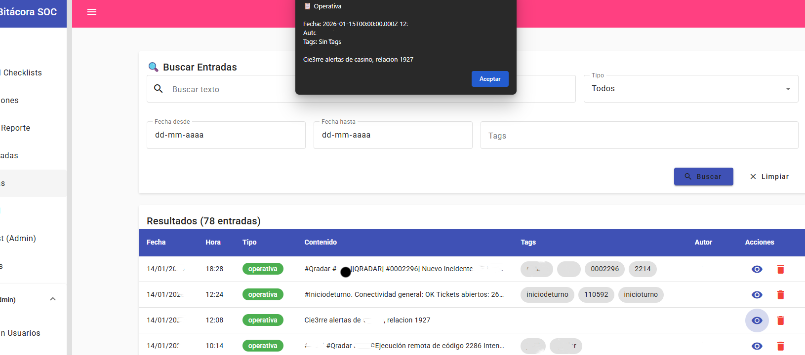
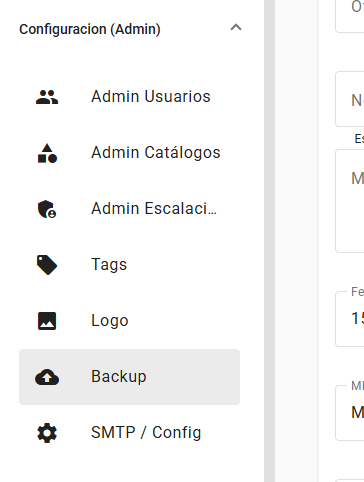

# Imágenes de screenshots

Esta carpeta contiene las capturas de pantalla del sistema BitacoraSOC.

## Estructura

- `01-main-nueva-entrada.png` - Pantalla principal con formulario de nueva entrada.
  

- `02-escalacion-turnos.png` - Vista de turnos semanales y escalación.
  

- `03-buscar-entradas.png` - Búsqueda y filtrado de entradas.
  

- `04-generador-reportes.png` - Formulario de generación de reportes.
  

- `05-menu-configuracion.png` - Menú de configuración administrativa.
  

- `06-menu-admin-backup.png` - Menú admin con backup seleccionado.
  

- `07-sidebar-menu.png` - Menú lateral completo de navegación.
  

**Total:** 7 capturas | ~543 KB

## Cómo agregar screenshots

1. Toma la captura de pantalla
2. Guárdala en esta carpeta con nombre descriptivo
3. Actualiza `docs/SCREENSHOTS.md` con la nueva imagen
4. Optimiza el tamaño si es >500 KB: `pngquant imagen.png --output imagen-optimized.png`

## Recomendaciones

- **Formato**: PNG para UI, JPG para fotos
- **Resolución**: 1920x1080 o menor
- **Peso**: Máximo 500 KB por imagen
- **Nombres**: Usar formato `##-descripcion-corta.png`

## .gitignore

Las imágenes están ignoradas en git por peso. Para compartirlas:
- Súbelas a un issue de GitHub
- Usa Google Drive/Dropbox para el equipo
- Almacénalas en un CDN si es para producción